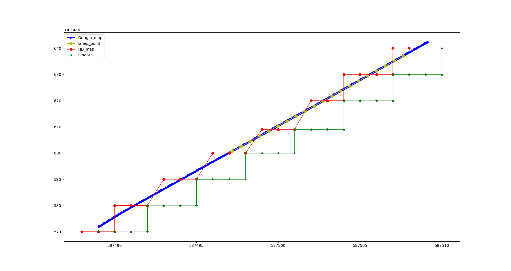
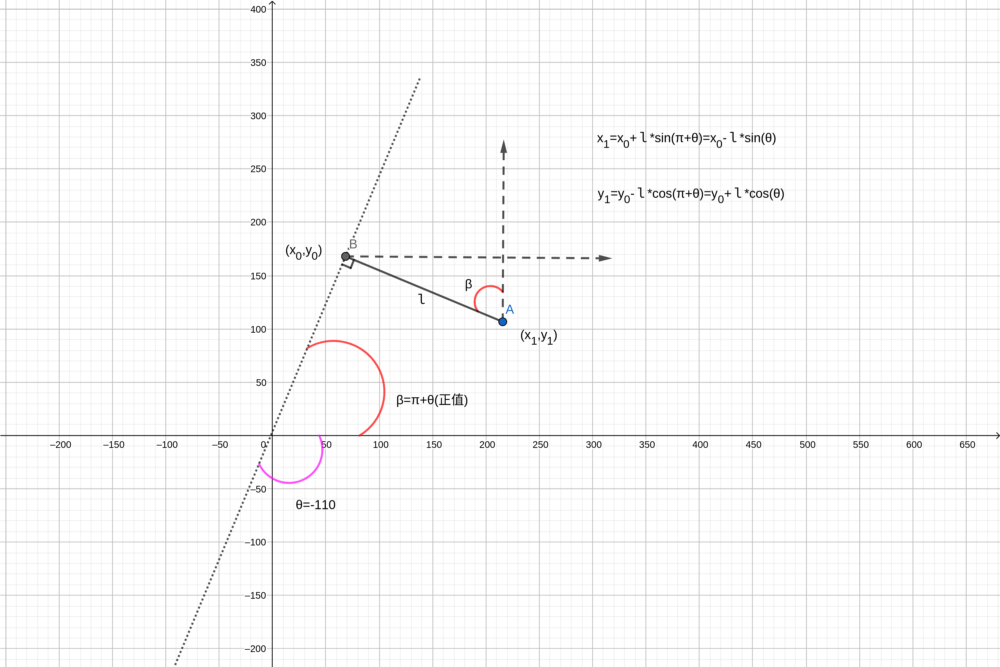
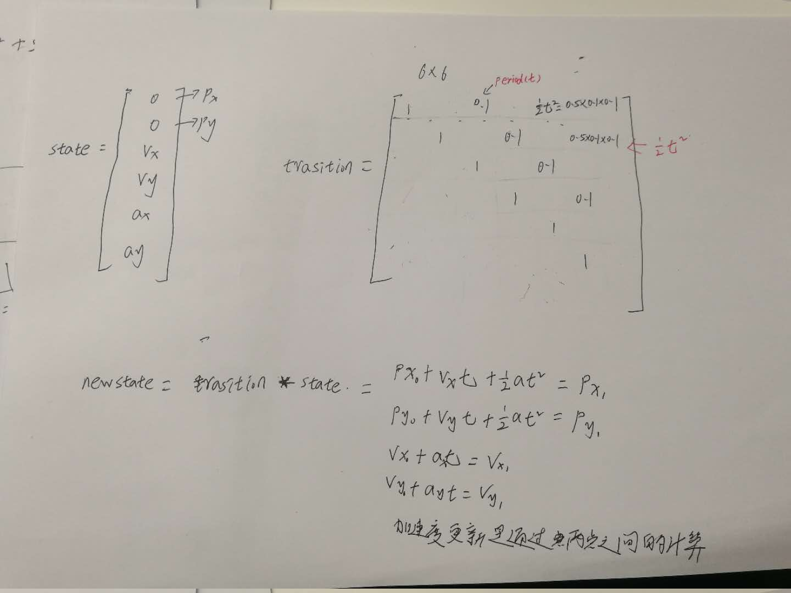
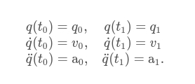
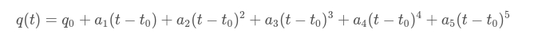
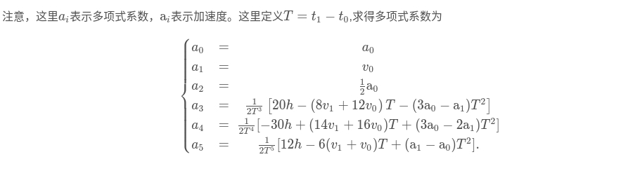
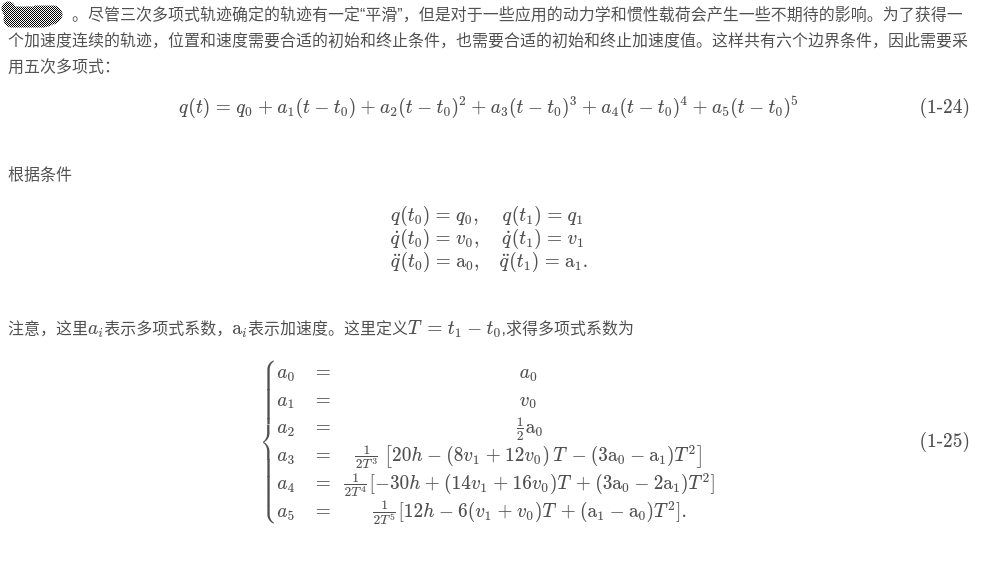

# 预测模块流程
## protobuf加载说明
* protobuf相当于定义一个结构体，里面存着一些数据（相当于变量），然后protobuf里面存在着一些机制，可以把该结构体变成类，
* 然后有一些读函数、写函数，
  ```
    student.set_id(201421031059);
    student.set_name("wpc1");//下面的这两种也可以

    deserializedStudent.id();
    deserializedStudent.name();
    ```
* 以及从文件读取和写入的函数来对数据进行操作，
    ```
    string serializedStr;
    student.SerializeToString(&serializedStr);

    tutorial::Student deserializedStudent;
    deserializedStudent.ParseFromString(serializedStr)
    ```
* 中间用到了Gflags来存取一些变量。如
   
 ```   
 #include <gflags/gflags.h>

 #include <glog/logging.h>

 #include <iostream>

using namespace std;

//DEFINE_xxxxx(参数名， 默认值， --help时的说明文字) 定义命令行参数，
//注意是全局。
DEFINE_int32(iterations, 50,  
    "The number of iterations to run."); 

int main(int argc,char* argv[])
{  
	cout<<"Hello main()"<<endl;
	//将所有日志输出到文件和stderr(终端)
	FLAGS_alsologtostderr = 1;
 
	//FLAGS_log_dir设置日志输出目录。/home/ww/GoogleLog/glogExample/log
	FLAGS_log_dir = "/home/ww/GoogleLog/glogExample/log"; 
 
	//gflags::ParseCommandLineFlags()解析命令行参数
    gflags::ParseCommandLineFlags(&argc, &argv, true);  
		
	//访问命令行参数，要在参数名称前面加前缀FLAGS_
	cout<<"iterations: "<<FLAGS_iterations<<endl;
      


	//输出日志文件到日志目录
    google::InitGoogleLogging(argv[0]);
 
	//对应级别的日志打印在对应级别的日志文件中
	//日志级别：INFO, WARNING, ERROR, FATAL、分别对应级别
	//0, 1, 2, 3

	LOG(INFO)<<"LOG level 0";
    LOG(WARNING)<<"LOG level 1";
	LOG(ERROR)<<"LOG level 2";
    LOG(FATAL)<<"LOG level 3";
      
	gflags::ShutDownCommandLineFlags();
    //google::ShutdownGoogleLogging();

	cout<<"Goodbye main()"<<endl;
        return 0;
 
}

```


## 加载adapter_conf  该文件主要用定义nodehandle和话题 和 每一个接受话题创建一个Container

 * AdapterManager::Init(adapter_conf_);//定义nodehandle和话题。

 * ContainerManager::instance()->Init(adapter_conf_);//初始化ContainerManager，每一个接受话题创建一个Container，用于接受话题数据。
```
config {
  **type**: PERCEPTION_OBSTACLES
  **mode**: RECEIVE_ONLY
  **message_history_limit**: 1
}
config {
  type: LOCALIZATION
  mode: RECEIVE_ONLY
  message_history_limit: 10
}
config {
  type: PLANNING_TRAJECTORY
  mode: RECEIVE_ONLY
  message_history_limit: 1
}
config {
  type: RELATIVE_MAP
  mode: RECEIVE_ONLY
  message_history_limit: 1
}
config {
  type: PREDICTION
  mode: PUBLISH_ONLY
  message_history_limit: 10  
}
is_ros: true
```
* 结果：
  
  adapter_conf_的类型为 *common::adapter::AdapterManagerConfig adapter_conf_;*
  AdapterManagerConfig为protobuf定义的类 里面的变量为
  ```
  message AdapterConfig {
  enum MessageType {
    POINT_CLOUD = 1;
    VLP16_POINT_CLOUD = 58;
    GPS = 2;
    IMU = 3;
    CHASSIS = 4;
    LOCALIZATION = 5;
    PLANNING_TRAJECTORY = 6;
    RTCM_DATA = 57;
    RACOBIT_RADAR = 59;
    POINT_CLOUD_RAW = 60;
  }
  enum Mode {
    RECEIVE_ONLY = 0;
    PUBLISH_ONLY = 1;
    DUPLEX = 2;
  }
  required MessageType **type** = 1;
  required Mode **mode** = 2;
  // The max number of received messages to keep in the adapter, this field
  // is not useful for PUBLISH_ONLY mode messages.
  optional int32 **message_history_limit** = 3 [default = 10];
  optional bool latch = 4 [default=false];
}

// A config to specify which messages a certain module would consume and
// produce.
message AdapterManagerConfig {
  **repeated** **AdapterConfig** config = 1;
  required bool is_ros = 2;  // Whether the message comes from ROS
}

  ```
 
```
## 加载prediction_conf  
```
obstacle_conf {
  obstacle_type: VEHICLE
  obstacle_status: ON_LANE
  evaluator_type: MLP_EVALUATOR
  predictor_type: MOVE_SEQUENCE_PREDICTOR
}
obstacle_conf {
  obstacle_type: VEHICLE
  obstacle_status: OFF_LANE
  predictor_type: FREE_MOVE_PREDICTOR
}
obstacle_conf {
  obstacle_type: PEDESTRIAN
  predictor_type: FREE_MOVE_PREDICTOR
}
obstacle_conf {
  obstacle_type: BICYCLE 
  obstacle_status: ON_LANE
  evaluator_type: MLP_EVALUATOR
  predictor_type: MOVE_SEQUENCE_PREDICTOR
}
obstacle_conf {
  obstacle_type: BICYCLE
  obstacle_status: OFF_LANE
  predictor_type: FREE_MOVE_PREDICTOR
}
obstacle_conf {
  obstacle_type: UNKNOWN
  obstacle_status: ON_LANE
  evaluator_type: RNN_EVALUATOR  
  predictor_type: LANE_SEQUENCE_PREDICTOR
}
obstacle_conf {
  obstacle_type: UNKNOWN
  obstacle_status: OFF_LANE
  predictor_type: FREE_MOVE_PREDICTOR
}
```


## 进入到 ContainerManager::instance()->Init(adapter_conf_); 初始化函数中，根据配置信息，然后进行容器的注册
container_manager.cc:72] Container [11] is registered.
container_manager.cc:72] Container [5] is registered.
container_manager.cc:72] Container [6] is registered.
container_manager.cc:72] Container [40] is registered


##  EvaluatorManager::instance()->Init(prediction_conf_);//配置用什么评估器 
首先会实例化一个评估器对象，然后进行注册，注册类型为三个 MLP RNN 和 COST 
实例化完之后，进入初始化函数Init(prediction_conf_)，根据文件内容，创建具体的评估器

```
import "modules/perception/proto/perception_obstacle.proto";
//在 prediction_conf.proto中添加一个新的预测期类型
message ObstacleConf {
   enum ObstacleStatus {
    ON_LANE = 0;
    OFF_LANE = 1;
    STATIONARY = 3;
    MOVING = 4;
  }

  enum EvaluatorType {
    MLP_EVALUATOR = 0;
    RNN_EVALUATOR = 1;
    COST_EVALUATOR = 2;    // navi mode can only support this evaluator
  }

  enum PredictorType {
    LANE_SEQUENCE_PREDICTOR = 0;
    FREE_MOVE_PREDICTOR = 1;
    REGIONAL_PREDICTOR = 2;
    MOVE_SEQUENCE_PREDICTOR = 3;
    EMPTY_PREDICTOR = 4;
    SINGLE_LANE_PREDICTOR = 5;
  }

  optional apollo.perception.PerceptionObstacle.Type obstacle_type = 1;
  optional ObstacleStatus obstacle_status = 2;
  optional EvaluatorType evaluator_type = 3;
  optional PredictorType predictor_type = 4;
}

message PredictionConf {
  repeated ObstacleConf obstacle_conf = 1; 
}
```

* perception obstacle
```
package apollo.perception;

import "modules/common/proto/error_code.proto";
import "modules/common/proto/header.proto";
import "modules/map/proto/map_lane.proto";

// TODO(all) change to Point3D
message Point {
  optional double x = 1;  // in meters.
  optional double y = 2;  // in meters.
  optional double z = 3;  // height in meters.
}

message PerceptionObstacle {
  optional int32 id = 1;  // obstacle ID.
  optional Point position = 2;  // obstacle position in the world coordinate
                                // system.
  optional double theta = 3;  // heading in the world coordinate system.
  optional Point velocity = 4;  // obstacle velocity.

  // Size of obstacle bounding box.
  optional double length = 5;  // obstacle length.
  optional double width = 6;  // obstacle width.
  optional double height = 7;  // obstacle height.

  repeated Point polygon_point = 8;  // obstacle corner points.
  // duration of an obstacle since detection in s.
  optional double tracking_time = 9;

  enum Type {
    UNKNOWN = 0;
    UNKNOWN_MOVABLE = 1;
    UNKNOWN_UNMOVABLE = 2;
    PEDESTRIAN = 3;  // Pedestrian, usually determined by moving behaviour.
    BICYCLE = 4;  // bike, motor bike
    VEHICLE = 5;  // Passenger car or truck.
  };
  optional Type type = 10;  // obstacle type
  optional double timestamp = 11;  // GPS time in seconds.

  // Just for offline debuging, onboard will not fill this field.
  // Format like : [x0, y0, z0, x1, y1, z1...]
  repeated double point_cloud = 12 [packed = true];

  optional double confidence = 13 [default = 1.0];
  enum ConfidenceType {
      CONFIDENCE_UNKNOWN = 0;
      CONFIDENCE_CNN = 1;
      CONFIDENCE_RADAR = 2;
  };
  optional ConfidenceType confidence_type = 14 [default = CONFIDENCE_CNN];
  repeated Point drops = 15;  // trajectory of object.
}

message CIPVInfo {
  optional int32 cipv_id = 1;
  repeated int32 potential_cipv_id = 2;
}

message LaneMarker {
  optional apollo.hdmap.LaneBoundaryType.Type lane_type = 1;
  optional double quality = 2; // range = [0,1]; 1 = the best quality
  optional int32 model_degree = 3;
  // equation X = c3 * Z^3 + c2 * Z^2 + c1 * Z + c0
  optional double c0_position = 4;
  optional double c1_heading_angle = 5;
  optional double c2_curvature = 6;
  optional double c3_curvature_derivative = 7;
  optional double view_range = 8;
  optional double longitude_start = 9;
  optional double longitude_end = 10;
}

message LaneMarkers {
  optional LaneMarker left_lane_marker = 1;
  optional LaneMarker right_lane_marker = 2;
  repeated LaneMarker next_left_lane_marker = 3;
  repeated LaneMarker next_right_lane_marker = 4;
}

message PerceptionObstacles {
  repeated PerceptionObstacle perception_obstacle = 1;  // An array of obstacles
  optional apollo.common.Header header = 2;  // Header
  optional apollo.common.ErrorCode error_code = 3 [default = OK];
  optional LaneMarkers lane_marker = 4;
  optional CIPVInfo cipv_info = 5; // closest in path vehicle
}
```

## 预测器初始化 
* PredictorManager::instance()->Init(prediction_conf_);
实例化一个预测器管理器，进行一些预测器注册
- 进入到Init(prediction_conf_)函数，根据预测器配置文件内容创建预测器

## 加载地图
```
  if (!FLAGS_use_navigation_mode && !PredictionMap::Ready()) {
    return OnError("Map cannot be loaded.");
  }
```
## 设置回调函数
```
 // Set localization callback function
  AdapterManager::AddLocalizationCallback(&Prediction::OnLocalization, this);
  // Set planning callback function
  AdapterManager::AddPlanningCallback(&Prediction::OnPlanning, this);
  // Set perception obstacle callback function
  AdapterManager::AddPerceptionObstaclesCallback(&Prediction::RunOnce, this);
```
## 等待上游信息发来
- 当收到位置信息的时候

- 当收到轨迹信息的时候

- 当收到障碍物信息的时候

### 当收到位置信息的时候   在位置模块定义的LocalizationEstimate protobuf转化为在感知模块定义的PerceptionObstacle protobuf
* 进入到位置容器的插入函数 PoseContainer::Insert(const ::google::protobuf::Message& message)，把位置信息插进去，该函数输出
```
ADC obstacle [id: -1 position { x: 587519.29816521925 y: 4140671.2333945441 z: -29.382750053809186 } theta: 0.29915312002799066 velocity { x: 4.1324353345281155 y: 1.0387828658500327 z: 0.055262792966305582 } type: VEHICLE timestamp: 1514497066.3043764].
```
* prediction 的位置信息
```
prediction.cc:218] [DEBUG] Received a localization message
[header { timestamp_sec: 1514497066.3043764 } pose { position { x: 587519.29816521925 y: 4140671.2333945441 z: -29.382750053809186 } orientation { qx: 0.020386851953162435 qy: -0.011855797691231091 qz: 0.59362515555461681 qw: -0.80439604115218111 } linear_velocity { x: 4.1324353345281155 y: 1.0387828658500327 z: 0.055262792966305582 } linear_acceleration { x: -0.01850931226216207 y: 1.7226632586384478 z: -0.13041422415926718 } angular_velocity { x: -0.059764772879833637 y: 0.03143824149258749 z: 0.352800174017912 } heading: 0.29915312002743022 linear_acceleration_vrf { x: -1.6018562018871307 y: 0.036209821701049805 z: 9.6902810037136078 } angular_velocity_vrf { x: -0.045856044945476682 y: -0.064329774450462368 z: 0.35040984169070422 } euler_angles { x: -0.0468911875420399 y: -0.0051364513673885009 z: -1.2716432067674663 } } uncertainty { position_std_dev { x: 0.010171831688388679 y: 0.021710262943970351 z: 0.013607357343834572 } orientation_std_dev { x: 0.0991409149731328 y: 0.084244386576766861 z: 0.051290768047071042 } linear_velocity_std_dev { x: 0.014528055429661211 y: 0.022244384788602134 z: 0.0081764586611775235 } } measurement_time: 1514497066.283849].
```

PS：第一个类型为：apollo::perception::PerceptionObstacle 在感知模块定义的protobuf
    第二个输出类型为 LocalizationEstimate& localization  在位置模块定义的protobuf

```
**LocalizationEstimate的数据类型**
message Uncertainty {
  // Standard deviation of position, east/north/up in meters.
  optional apollo.common.Point3D position_std_dev = 1;

  // Standard deviation of quaternion qx/qy/qz, unitless.
  optional apollo.common.Point3D orientation_std_dev = 2;

  // Standard deviation of linear velocity, east/north/up in meters per second.
  optional apollo.common.Point3D linear_velocity_std_dev = 3;

  // Standard deviation of linear acceleration, right/forward/up in meters per
  // square second.
  optional apollo.common.Point3D linear_acceleration_std_dev = 4;

  // Standard deviation of angular velocity, right/forward/up in radians per
  // second.
  optional apollo.common.Point3D angular_velocity_std_dev = 5;

  // TODO: Define covariance items when needed.
}

message LocalizationEstimate {
  optional apollo.common.Header header = 1;
  optional apollo.localization.Pose pose = 2;
  optional Uncertainty uncertainty = 3;

  // The time of pose measurement, seconds since the GPS epoch (Jan 6, 1980).
  optional double measurement_time = 4;  // In seconds.

  // Future trajectory acturally driven by the drivers
  repeated apollo.common.TrajectoryPoint trajectory_point = 5;
}

enum MeasureState {
  NOT_VALID = 0;
  NOT_STABLE = 1;
  OK = 2;
  VALID = 3;
}

message LocalizationStatus {
  optional apollo.common.Header header = 1;
  optional MeasureState fusion_status = 2;
  optional MeasureState gnss_status = 3;
  optional MeasureState lidar_status = 4;

  // The time of pose measurement, seconds since the GPS epoch (Jan 6, 1980).
  optional double measurement_time = 5;  // In seconds.
}
```

```
**PerceptionObstacle的数据类型**
package apollo.perception;

import "modules/common/proto/error_code.proto";
import "modules/common/proto/header.proto";
import "modules/map/proto/map_lane.proto";

// TODO(all) change to Point3D
message Point {
  optional double x = 1;  // in meters.
  optional double y = 2;  // in meters.
  optional double z = 3;  // height in meters.
}

message PerceptionObstacle {
  optional int32 id = 1;  // obstacle ID.
  optional Point position = 2;  // obstacle position in the world coordinate
                                // system.
  optional double theta = 3;  // heading in the world coordinate system.
  optional Point velocity = 4;  // obstacle velocity.

  // Size of obstacle bounding box.
  optional double length = 5;  // obstacle length.
  optional double width = 6;  // obstacle width.
  optional double height = 7;  // obstacle height.

  repeated Point polygon_point = 8;  // obstacle corner points.
  // duration of an obstacle since detection in s.
  optional double tracking_time = 9;

  enum Type {
    UNKNOWN = 0;
    UNKNOWN_MOVABLE = 1;
    UNKNOWN_UNMOVABLE = 2;
    PEDESTRIAN = 3;  // Pedestrian, usually determined by moving behaviour.
    BICYCLE = 4;  // bike, motor bike
    VEHICLE = 5;  // Passenger car or truck.
  };
  optional Type type = 10;  // obstacle type
  optional double timestamp = 11;  // GPS time in seconds.

  // Just for offline debuging, onboard will not fill this field.
  // Format like : [x0, y0, z0, x1, y1, z1...]
  repeated double point_cloud = 12 [packed = true];

  optional double confidence = 13 [default = 1.0];
  enum ConfidenceType {
      CONFIDENCE_UNKNOWN = 0;
      CONFIDENCE_CNN = 1;
      CONFIDENCE_RADAR = 2;
  };
  optional ConfidenceType confidence_type = 14 [default = CONFIDENCE_CNN];
  repeated Point drops = 15;  // trajectory of object.
}

message CIPVInfo {
  optional int32 cipv_id = 1;
  repeated int32 potential_cipv_id = 2;
}

message LaneMarker {
  optional apollo.hdmap.LaneBoundaryType.Type lane_type = 1;
  optional double quality = 2; // range = [0,1]; 1 = the best quality
  optional int32 model_degree = 3;
  // equation X = c3 * Z^3 + c2 * Z^2 + c1 * Z + c0
  optional double c0_position = 4;
  optional double c1_heading_angle = 5;
  optional double c2_curvature = 6;
  optional double c3_curvature_derivative = 7;
  optional double view_range = 8;
  optional double longitude_start = 9;
  optional double longitude_end = 10;
}

message LaneMarkers {
  optional LaneMarker left_lane_marker = 1;
  optional LaneMarker right_lane_marker = 2;
  repeated LaneMarker next_left_lane_marker = 3;
  repeated LaneMarker next_right_lane_marker = 4;
}

message PerceptionObstacles {
  repeated PerceptionObstacle perception_obstacle = 1;  // An array of obstacles
  optional apollo.common.Header header = 2;  // Header
  optional apollo.common.ErrorCode error_code = 3 [default = OK];
  optional LaneMarkers lane_marker = 4;
  optional CIPVInfo cipv_info = 5; // closest in path vehicle
}

```
### 当收到轨迹信息的时候 
首先进入到ADCTrajectoryContainer::Insert(const ::google::protobuf::Message& message)下
该函数完成三件事：
- 输出protobuf结构下的ADCTrajectory， ADCTrajectory在规划模块的protobuf 结构变量如下
- Find junction 不知道干撒的？？？？
- Find ADC lane sequence 是不是找到自己车的轨迹车道序列
Generate an ADC lane id sequence [4_1_-1->87a_1_-1->52_1_-1->2579_1_-1->57_1_-2->2147_1_-2->2146_1_-2->1851_1_-2].
```
package apollo.planning;

import "modules/canbus/proto/chassis.proto";
import "modules/common/proto/drive_state.proto";
import "modules/common/proto/geometry.proto";
import "modules/common/proto/header.proto";
import "modules/common/proto/pnc_point.proto";
import "modules/common/proto/vehicle_signal.proto";
import "modules/map/proto/map_id.proto";
import "modules/planning/proto/decision.proto";
import "modules/planning/proto/planning_internal.proto";

// Deprecated: replaced by apollo.common.TrajectoryPoint
message ADCTrajectoryPoint {
  optional double x = 1;  // in meters.
  optional double y = 2;  // in meters.
  optional double z = 3;  // height in meters.

  optional double speed = 6;  // speed, in meters / second
  optional double acceleration_s = 7;  // acceleration in s direction
  optional double curvature = 8;  // curvature (k = 1/r), unit: (1/meters)
  // change of curvature in unit s (dk/ds)
  optional double curvature_change_rate = 9;
  // in seconds (relative_time = time_of_this_state - timestamp_in_header)
  optional double relative_time = 10;
  optional double theta = 11;  // relative to absolute coordinate system
  // calculated from the first point in this trajectory
  optional double accumulated_s = 12;

  // in meters, reference to route SL-coordinate
  optional double s = 4 [deprecated = true];
  // in meters, reference to route SL-coordinate
  optional double l = 5 [deprecated = true];
}

// Deprecated: replaced by apollo.common.PathPoint
message ADCPathPoint {
  optional double x = 1;  // in meters
  optional double y = 2;  // in meters
  optional double z = 3;  // in meters
  optional double curvature = 4;  // curvature (k = 1/r), unit: (1/meters)
  optional double heading = 5;  // relative to absolute coordinate system
}

message ADCSignals {
  enum SignalType {
    LEFT_TURN = 1;
    RIGHT_TURN = 2;
    LOW_BEAM_LIGHT = 3;
    HIGH_BEAM_LIGHT = 4;
    FOG_LIGHT = 5;
    EMERGENCY_LIGHT = 6;
  }
  repeated SignalType signal = 1;
}

message EStop {
  // is_estop == true when emergency stop is required
  optional bool is_estop = 1;
  optional string reason = 2;
}

message TaskStats {
  optional string name = 1;
  optional double time_ms = 2;
}

message LatencyStats {
  optional double total_time_ms = 1;
  repeated TaskStats task_stats = 2;
  optional double init_frame_time_ms = 3;
}

// next id: 21
message ADCTrajectory {
  optional apollo.common.Header header = 1;

  optional double total_path_length = 2; // in meters
  optional double total_path_time = 3; // in seconds

  // path data + speed data
  repeated apollo.common.TrajectoryPoint trajectory_point = 12;

  optional EStop estop = 6;

  // path point without speed info
  repeated apollo.common.PathPoint path_point = 13;

  // is_replan == true mean replan triggered
  optional bool is_replan = 9 [default = false];

  // Specify trajectory gear
  optional apollo.canbus.Chassis.GearPosition gear = 10;

  optional apollo.planning.DecisionResult decision = 14;

  optional LatencyStats latency_stats = 15;

  // the routing used for current planning result
  optional apollo.common.Header routing_header = 16;
  optional apollo.planning_internal.Debug debug = 8;

  // replaced by path_point
  repeated ADCPathPoint adc_path_point = 7 [deprecated=true];
  // replaced by trajectory_point
  repeated ADCTrajectoryPoint adc_trajectory_point = 4 [deprecated=true];
  optional apollo.common.VehicleSignal signal = 11 [deprecated=true];
  enum RightOfWayStatus {
    UNPROTECTED = 0;
    PROTECTED = 1;
  }
  optional RightOfWayStatus right_of_way_status = 17;

  // lane id along reference line
  repeated apollo.hdmap.Id lane_id = 18;

  // set the engage advice for based on current planning result.
  optional apollo.common.EngageAdvice engage_advice = 19;

  // the region where planning cares most
  message CriticalRegion {
    repeated apollo.common.Polygon region = 1;
  }

  // critial region will be empty when planning is NOT sure which region is critical
  // critial regions may or may not overlap
  optional CriticalRegion critical_region = 20;
}

```

得到的数据
```
adc_trajectory_container.cc:44] [DEBUG] Received a planning message [header { timestamp_sec: 1514497066.3806622 module_name: "planning" sequence_num: 1969 } total_path_length: 36.620409636021265 total_path_time: 5.7206579208373993 debug { planning_data { path { name: "DpPolyPathOptimizer" path_point { x: 587519.83785207826 y: 4140671.9864518689 z: 0 theta: 0.2386040515055301 kappa: 0.087421611354481385 s: 0 dkappa: 0 ddkappa: 0 } path_point { x: 587521.573364862 y: 4140672.5662086112 z: 0 theta: 0.39482518473909156 kappa: 0.080744499228738442 s: 1.8297875567549617 dkappa: -0.0036491187739764023 ddkappa: 0 } path_point { x: 587523.23209090321 y: 4140673.4110004678 z: 0 theta: 0.53353555315154377 kappa: 0.0714401903776224 s: 3.6912507878558478 dkappa: -0.004998384440617387 ddkappa: 0 }   path_point { x: 587514.36951788084 y: 4140670.9182083183 theta: -0.26181981284373507 kappa: 0.088145620794526772 dkappa: 0.0039934014922696978 }}}}
```

prediction 输出的数据 和上面一样。没区别
```
prediction.cc:235] [DEBUG] Received a planning message [header { timestamp_sec: 1514497066.3806622 module_name: "planning" sequence_num: 1969 } total_path_length: 36.620409636021265 total_path_time: 5.7206579208373993 debug { planning_data { path { name: "DpPolyPathOptimizer" path_point { x: 587519.83785207826 y: 4140671.9864518689 z: 0 theta: 0.2386040515055301 kappa: 0.087421611354481385 s: 0 dkappa: 0 ddkappa: 0 } path_point { x: 587521.573364862 y: 4140672.5662086112 z: 0 theta: 0.39482518473909156 kappa: 0.080744499228738442 s: 1.8297875567549617 dkappa: -0.0036491187739764023 ddkappa: 0 } path_point { x: 587523.23209090321 y: 4140673.4110004678 z: 0 theta: 0.53353555315154377 kappa: 0.0714401903776224 s: 3.6912507878558478 dkappa: -0.004998384440617387 ddkappa: 0 } path_point { x: 587524.77896279225 y: 4140674.4798780787 z: 0 theta: 0.66011606160554281 kappa: 0.061655617879369282 s: 5.5714933222232634 dkappa: -0.0052038884981107092 ddkappa: 0 } }}}
```
### 当收到障碍物信息的时候
* 首先进入ObstaclesContainer::Insert(const ::google::protobuf::Message& message) 传来的障碍物类型为(const PerceptionObstacles& perception_obstacles) 
在ObstaclesContainer::Insert(）中 有如下代码 把许多障碍物进行循环，分别插入到容器中
```
for (const PerceptionObstacle& perception_obstacle :
       perception_obstacles.perception_obstacle()) {
    ADEBUG << "Perception obstacle [" << perception_obstacle.id() << "] "
           << "was detected";
    InsertPerceptionObstacle(perception_obstacle, timestamp_);
    ADEBUG << "Perception obstacle [" << perception_obstacle.id() << "] "
           << "was inserted";
  }
```
在ObstaclesContainer::InsertPerceptionObstacle(const PerceptionObstacle& perception_obstacle, const double timestamp)调用了
```
    Obstacle obstacle;
    obstacle.Insert(perception_obstacle, timestamp);
```
在该函数下obstacle.Insert(perception_obstacle, timestamp)完成了下面一些功能  **实质是把perception_obstacle的结构信息转化为Feature protobuf信息**
里面有一些车道信息还没有看懂？？？
```
I0121 11:21:19.112982 27644 obstacle.cc:289] [DEBUG] Obstacle has id [581].
I0121 11:21:19.112999 27644 obstacle.cc:305] [DEBUG] Obstacle [581] has type [5].
I0121 11:21:19.113004 27644 obstacle.cc:323] [DEBUG] Obstacle [581] has timestamp [1514497066.193600].
I0121 11:21:19.113016 27644 obstacle.cc:349] [DEBUG] Obstacle [581] has position [587525.986751, 4140658.677020, -30.188935].
I0121 11:21:19.113031 27644 obstacle.cc:421] [DEBUG] Obstacle [581] has velocity [-4.863482, -1.764945, 0.000000]
I0121 11:21:19.113039 27644 obstacle.cc:425] [DEBUG] Obstacle [581] has velocity heading [-2.793008] 
I0121 11:21:19.113042 27644 obstacle.cc:427] [DEBUG] Obstacle [581] has speed [5.173828].
I0121 11:21:19.113047 27644 obstacle.cc:491] [DEBUG] Obstacle [581] has acceleration [0.000000, 0.000000, 0.000000]
I0121 11:21:19.113057 27644 obstacle.cc:495] [DEBUG] Obstacle [581] has acceleration value [0.000000].
I0121 11:21:19.113063 27644 obstacle.cc:507] [DEBUG] Obstacle [581] has theta [-2.793008].
I0121 11:21:19.113067 27644 obstacle.cc:531] [DEBUG] Obstacle [581] has dimension [3.971890, 1.756439, 2.261241].
I0121 11:21:19.114349 27644 obstacle.cc:698] [DEBUG] Obstacle [581] has no current lanes.
I0121 11:21:19.114930 27644 obstacle.cc:812] [DEBUG] Obstacle [581] has nearby lanes [lane_id: "10891a_1_-1" lane_turn_type: 2 lane_s: 10.400146177419144 lane_l: 3.7988917969635603 angle_diff: 0 dist_to_left_boundary: -2.0035669022476656 dist_to_right_boundary: 5.5942166916794545]
I0121 11:21:19.115264 27644 obstacle.cc:865] [DEBUG] Obstacle [581] set a lane sequence [lane_segment { lane_id: "10891a_1_-1" start_s: 10.400146177419144 end_s: 35.404009525605943 lane_turn_type: 2 total_length: 35.404009525605943 } lane_segment { lane_id: "2443_1_-1" start_s: 0 end_s: 71.98377712823364 lane_turn_type: 1 total_length: 71.98377712823364 } lane_segment { lane_id: "11202_1_-1" start_s: 0 end_s: 11.095393714872522 lane_turn_type: 1 total_length: 11.095393714872522 } lane_segment { lane_id: "11213a_1_-1" start_s: 0 end_s: 9.81581945560343 lane_turn_type: 3 total_length: 9.81581945560343 } lane_segment { lane_id: "1876_1_-1" start_s: 0 end_s: 8.4947328062606573 lane_turn_type: 1 total_length: 8.4947328062606573 } label: 0].
I0121 11:21:19.115329 27644 obstacle.cc:865] [DEBUG] Obstacle [581] set a lane sequence [lane_segment { lane_id: "10891a_1_-1" start_s: 10.400146177419144 end_s: 35.404009525605943 lane_turn_type: 2 total_length: 35.404009525605943 } lane_segment { lane_id: "2443_1_-1" start_s: 0 end_s: 71.98377712823364 lane_turn_type: 1 total_length: 71.98377712823364 } lane_segment { lane_id: "11202_1_-1" start_s: 0 end_s: 11.095393714872522 lane_turn_type: 1 total_length: 11.095393714872522 } lane_segment { lane_id: "1873_1_-1" start_s: 0 end_s: 9.183360682400572 lane_turn_type: 1 total_length: 9.183360682400572 } lane_segment { lane_id: "594_1_-1" start_s: 0 end_s: 8.1204452634397342 lane_turn_type: 1 total_length: 8.1204452634397342 } lane_segment { lane_id: "11215_1_-1" start_s: 0 end_s: 9.43511074313672 lane_turn_type: 1 total_length: 9.43511074313672 } lane_segment { lane_id: "513_1_-2" start_s: 0 end_s: 34.568669148737143 lane_turn_type: 1 total_length: 39.469537946938253 } label: 0].
I0121 11:21:19.115425 27644 obstacle.cc:865] [DEBUG] Obstacle [581] set a lane sequence [lane_segment { lane_id: "10891a_1_-1" start_s: 10.400146177419144 end_s: 35.404009525605943 lane_turn_type: 2 total_length: 35.404009525605943 } lane_segment { lane_id: "2443_1_-1" start_s: 0 end_s: 71.98377712823364 lane_turn_type: 1 total_length: 71.98377712823364 } lane_segment { lane_id: "11202_1_-1" start_s: 0 end_s: 11.095393714872522 lane_turn_type: 1 total_length: 11.095393714872522 } lane_segment { lane_id: "1873_1_-1" start_s: 0 end_s: 9.183360682400572 lane_turn_type: 1 total_length: 9.183360682400572 } lane_segment { lane_id: "595_1_-1" start_s: 0 end_s: 17.690032777263962 lane_turn_type: 1 total_length: 17.690032777263962 } lane_segment { lane_id: "513_1_-1" start_s: 0 end_s: 34.434192378049659 lane_turn_type: 1 total_length: 38.469505634393371 } label: 0].
I0121 11:21:19.116092 27644 obstacle.cc:948] [DEBUG] Obstacle [581] has lane segments and points.
I0121 11:21:19.116144 27644 obstacle.cc:878] [DEBUG] Obstacle [581] set lane graph features.
I0121 11:21:19.116184 27644 obstacle.cc:1070] [DEBUG] Obstacle [581] inserted a frame into the history.
I0121 11:21:19.116189 27644 obstacle.cc:986] [DEBUG] Obstacle [581] has no history and is considered moving.
I0121 11:21:19.116307 27644 obstacles_container.cc:65] [DEBUG] Perception obstacle [581] was inserted
```
* PerceptionObstacle和PerceptionObstacles protobuf格式
```
syntax = "proto2";

package apollo.perception;

import "modules/common/proto/error_code.proto";
import "modules/common/proto/header.proto";
import "modules/map/proto/map_lane.proto";

// TODO(all) change to Point3D
message Point {
  optional double x = 1;  // in meters.
  optional double y = 2;  // in meters.
  optional double z = 3;  // height in meters.
}

message PerceptionObstacle {
  optional int32 id = 1;  // obstacle ID.
  optional Point position = 2;  // obstacle position in the world coordinate
                                // system.
  optional double theta = 3;  // heading in the world coordinate system.
  optional Point velocity = 4;  // obstacle velocity.

  // Size of obstacle bounding box.
  optional double length = 5;  // obstacle length.
  optional double width = 6;  // obstacle width.
  optional double height = 7;  // obstacle height.

  repeated Point polygon_point = 8;  // obstacle corner points.
  // duration of an obstacle since detection in s.
  optional double tracking_time = 9;

  enum Type {
    UNKNOWN = 0;
    UNKNOWN_MOVABLE = 1;
    UNKNOWN_UNMOVABLE = 2;
    PEDESTRIAN = 3;  // Pedestrian, usually determined by moving behaviour.
    BICYCLE = 4;  // bike, motor bike
    VEHICLE = 5;  // Passenger car or truck.
  };
  optional Type type = 10;  // obstacle type
  optional double timestamp = 11;  // GPS time in seconds.

  // Just for offline debuging, onboard will not fill this field.
  // Format like : [x0, y0, z0, x1, y1, z1...]
  repeated double point_cloud = 12 [packed = true];

  optional double confidence = 13 [default = 1.0];
  enum ConfidenceType {
      CONFIDENCE_UNKNOWN = 0;
      CONFIDENCE_CNN = 1;
      CONFIDENCE_RADAR = 2;
  };
  optional ConfidenceType confidence_type = 14 [default = CONFIDENCE_CNN];
  repeated Point drops = 15;  // trajectory of object.
}

message CIPVInfo {
  optional int32 cipv_id = 1;
  repeated int32 potential_cipv_id = 2;
}

message LaneMarker {
  optional apollo.hdmap.LaneBoundaryType.Type lane_type = 1;
  optional double quality = 2; // range = [0,1]; 1 = the best quality
  optional int32 model_degree = 3;
  // equation X = c3 * Z^3 + c2 * Z^2 + c1 * Z + c0
  optional double c0_position = 4;
  optional double c1_heading_angle = 5;
  optional double c2_curvature = 6;
  optional double c3_curvature_derivative = 7;
  optional double view_range = 8;
  optional double longitude_start = 9;
  optional double longitude_end = 10;
}

message LaneMarkers {
  optional LaneMarker left_lane_marker = 1;
  optional LaneMarker right_lane_marker = 2;
  repeated LaneMarker next_left_lane_marker = 3;
  repeated LaneMarker next_right_lane_marker = 4;
}

message PerceptionObstacles {
  repeated PerceptionObstacle perception_obstacle = 1;  // An array of obstacles
  optional apollo.common.Header header = 2;  // Header
  optional apollo.common.ErrorCode error_code = 3 [default = OK];
  optional LaneMarkers lane_marker = 4;
  optional CIPVInfo cipv_info = 5; // closest in path vehicle
}

```
* Feature的protobuf格式
```
syntax = "proto2";

package apollo.prediction;

import "modules/prediction/proto/lane_graph.proto";
import "modules/common/proto/geometry.proto";
import "modules/perception/proto/perception_obstacle.proto";

message Lane {
    // Features of all possible current lanes
    repeated LaneFeature current_lane_feature = 1;

    // Features of the most possible current lane
    optional LaneFeature lane_feature = 2;

    // Features of all nearby lanes
    repeated LaneFeature nearby_lane_feature = 3;

    // Lane graph
    optional LaneGraph lane_graph = 4;

    // For modeling
    optional double label_update_time_delta = 26;
}

message LaneFeature {
    optional string lane_id = 1;
    optional uint32 lane_turn_type = 2;
    optional double lane_s = 3;
    optional double lane_l = 4;
    optional double angle_diff = 5;
    optional double dist_to_left_boundary = 6;
    optional double dist_to_right_boundary = 7;
}

message Feature {
    // Obstacle ID
    optional int32 id = 1;

    // Obstacle features
    optional apollo.common.Point3D position = 2;
    optional apollo.common.Point3D velocity = 3;
    optional apollo.common.Point3D acceleration = 4;
    optional double velocity_heading = 5;
    optional double speed = 6;
    optional double acc = 7;
    optional double theta = 8;
    optional double length = 9;
    optional double width = 10;
    optional double height = 11;
    optional double tracking_time = 12;
    optional double timestamp = 13;    

    // Obstacle type-specific features
    optional Lane lane = 14;

    // Obstacle tracked features
    optional apollo.common.Point3D t_position = 16;
    optional apollo.common.Point3D t_velocity = 17 [deprecated = true];
    optional double t_velocity_heading = 18 [deprecated = true];
    optional double t_speed = 19 [deprecated = true];
    optional apollo.common.Point3D t_acceleration = 20 [deprecated = true];
    optional double t_acc = 21 [deprecated = true];

    optional bool is_still = 22 [default = false];
    optional apollo.perception.PerceptionObstacle.Type type = 23;
    optional double label_update_time_delta = 24;
}

```

* prediction.cc:277] [DEBUG] Received a perception message  PerceptionObstacles里面包含好多PerceptionObstacle 如下

[perception_obstacle { id: 581 position { x: 587525.986751185 y: 4140658.67702036 z: -30.188934964873393 } theta: -2.7930081732842251 velocity { x: -4.8634821368796057 y: -1.7649454783445142 z: 0 } length: 3.9718897342681885 width: 1.7564393281936646 height: 2.2612409591674805 polygon_point { x: 587524.04460126359 y: 4140658.3570935628 z: -30.190014084068032 } polygon_point { x: 587523.95833829534 y: 4140658.7667191997 z: -30.18704159669641 } polygon_point { x: 587525.18374543486 y: 4140659.2610147819 z: -30.188058621272504 } polygon_point { x: 587527.38745772012 y: 4140660.1238019885 z: -30.190058146734923 } polygon_point { x: 587527.64295531053 y: 4140659.9065267434 z: -30.192361139450774 } polygon_point { x: 587527.65952388372 y: 4140659.885577878 z: -30.192555255205459 } polygon_point { x: 587527.736919826 y: 4140658.7948119338 z: -30.199943073948681 } polygon_point { x: 587527.33997482026 y: 4140658.3388766781 z: -30.20154453945921 } polygon_point { x: 587527.2511111974 y: 4140658.2576390826 z: -30.201767079381916 } polygon_point { x: 587526.81371405616 y: 4140658.0546589973 z: -30.201577337838859 } polygon_point { x: 587525.48940324213 y: 4140657.6239177366 z: -30.199802978870686 } polygon_point { x: 587524.25883051939 y: 4140657.6149780494 z: -30.195599981585151 } polygon_point { x: 587524.19291915162 y: 4140657.8117777491 z: -30.194087157833238 } polygon_point { x: 587524.15318863839 y: 4140657.9534936165 z: -30.193024546862215 } tracking_time: 86.036459922790527 type: VEHICLE timestamp: 1514497066.1936004 confidence: 0.98524969816207886 confidence_type: CONFIDENCE_CNN } 

perception_obstacle { id: 1643 position { x: 587531.01494942722 y: 4140698.6570618637 z: -30.199594003893932 } theta: -1.8377120552303083 velocity { x: 0 y: 0 z: 0 } length: 4.49996280670166 width: 2.0455760955810547 height: 1.8579772710800171 polygon_point { x: 587529.797320467 y: 4140697.345903262 z: -30.207927059271796 } polygon_point { x: 587529.79863424471 y: 4140697.4335269309 z: -30.207359658937484 } polygon_point { x: 587530.02002206794 y: 4140698.8963320837 z: -30.198578070514195 } polygon_point { x: 587530.698877185 y: 4140700.7729977774 z: -30.188679235312193 } polygon_point { x: 587530.88910580159 y: 4140701.0330970762 z: -30.187640220338849 } polygon_point { x: 587531.914151842 y: 4140699.140014159 z: -30.203546654912241 } polygon_point { x: 587531.74379243876 y: 4140697.6836147918 z: -30.212463136862418 } polygon_point { x: 587531.64609288261 y: 4140697.0893649147 z: -30.216003686393975 } polygon_point { x: 587531.55714010063 y: 4140696.8115036418 z: -30.217509347916941 } polygon_point { x: 587531.50246332842 y: 4140696.7316620406 z: -30.217841161332696 } polygon_point { x: 587531.40595361684 y: 4140696.6243650313 z: -30.218207322371232 } polygon_point { x: 587531.34224897681 y: 4140696.553786465 z: -30.218447410174235 } polygon_point { x: 587531.32115508686 y: 4140696.5357192731 z: -30.21849229492636 } polygon_point { x: 587531.26085620932 y: 4140696.5074997512 z: -30.218467684495128 } polygon_point { x: 587531.16119054763 y: 4140696.4922781875 z: -30.218221908701292 } polygon_point { x: 587530.59079337947 y: 4140696.4504513582 z: -30.216519698714656 } polygon_point { x: 587530.50749907794 y: 4140696.4695709879 z: -30.216106458523065 } polygon_point { x: 587530.38351589616 y: 4140696.5006286311 z: -30.215474393305016 } polygon_point { x: 587530.00242234522 y: 4140696.8005101788 z: -30.21219727465401 } polygon_point { x: 587529.90036313434 y: 4140696.8811469791 z: -30.211317509737931 } polygon_point { x: 587529.83451253443 y: 4140696.9558648574 z: -30.210601766444942 } polygon_point { x: 587529.810961926 y: 4140697.004274819 z: -30.210204224589624 } tracking_time: 4.2045938968658447 type: VEHICLE timestamp: 1514497066.1936004 confidence: 0.99005556106567383 confidence_type: CONFIDENCE_CNN }

 perception_obstacle { id: 1658 position { x: 587546.82363473 y: 4140648.3858521469 z: -29.56580892000397 } theta: 2.4948458394929869 velocity { x: -2.2902674967274348 y: 1.9068112819959124 z: 0 } length: 3.9886841773986816 width: 1.9043517112731934 height: 1.3668251037597656 polygon_point { x: 587545.30160412274 y: 4140649.4820812023 z: -29.565334606781008 } polygon_point { x: 587545.34905829106 y: 4140649.7489759554 z: -29.563756821972884 } polygon_point { x: 587545.73139345134 y: 4140650.0086617935 z: -29.563385751461684 } polygon_point { x: 587546.10215279786 y: 4140650.1268344037 z: -29.563898300566056 } polygon_point { x: 587547.74058117019 y: 4140648.4548522164 z: -29.580485616036846 } polygon_point { x: 587547.87416060024 y: 4140646.4780795542 z: -29.593851263050137 } polygon_point { x: 587547.608482325 y: 4140646.6019265996 z: -29.592122853628677 } tracking_time: 3.0039739608764648 type: VEHICLE timestamp: 1514497066.1936004 confidence: 0.97255849838256836 confidence_type: CONFIDENCE_CNN } 
 
 perception_obstacle { id: 1672 position { x: 587537.34206734714 y: 4140648.8927491195 z: -29.334803549387058 } theta: 2.2277129000080254 velocity { x: 0 y: 0 z: 0 } length: 0.2765268087387085 width: 0.30895113945007324 height: 1.170764684677124 polygon_point { x: 587537.15430485865 y: 4140648.8849977739 z: -29.334030314566036 } polygon_point { x: 587537.37700168369 y: 4140649.10214936 z: -29.333384068229154 } polygon_point { x: 587537.410157122 y: 4140648.9116883529 z: -29.334742086659851 } polygon_point { x: 587537.37777526816 y: 4140648.8085135003 z: -29.335303409295122 } polygon_point { x: 587537.33550086012 y: 4140648.722346358 z: -29.335719459833108 } tracking_time: 2.00346302986145 type: PEDESTRIAN timestamp: 1514497066.1936004 confidence: 0.68784505128860474 confidence_type: CONFIDENCE_CNN } 
 
 perception_obstacle { id: 1678 position { x: 587523.64753304538 y: 4140702.2536194809 z: -30.244709877111514 } theta: -1.8475801833988315 velocity { x: 0 y: 0 z: 0 } length: 3.5007994174957275 width: 2.9641120433807373 height: 0.81094050407409668 polygon_point { x: 587522.66768441477 y: 4140702.5070590377 z: -30.24179229767239 } polygon_point { x: 587522.4073447152 y: 4140703.2338293027 z: -30.236146888034895 } polygon_point { x: 587522.44485925487 y: 4140703.454029215 z: -30.234839476575257 } polygon_point { x: 587522.47193876584 y: 4140703.5054071881 z: -30.234597888504219 } polygon_point { x: 587524.75608449068 y: 4140703.7623087745 z: -30.240830770657681 } polygon_point { x: 587525.47853302129 y: 4140703.5512993503 z: -30.244709868397621 } polygon_point { x: 587525.1358834072 y: 4140702.0775815551 z: -30.253142769993342 } polygon_point { x: 587524.60026574228 y: 4140700.5148550365 z: -30.261488433158249 } polygon_point { x: 587524.48110989924 y: 4140700.3374610841 z: -30.262233719769792 } polygon_point { x: 587524.381186244 y: 4140700.2835170678 z: -30.2622398053339 } polygon_point { x: 587524.24263083912 y: 4140700.2788028666 z: -30.261790773098991 } polygon_point { x: 587524.15264918 y: 4140700.2909855256 z: -30.261399655252312 } polygon_point { x: 587524.06448754843 y: 4140700.3166776225 z: -30.260926659227106 } polygon_point { x: 587523.93886948063 y: 4140700.4089883938 z: -30.2598891123362 } polygon_point { x: 587523.8604672167 y: 4140700.514872673 z: -30.258926470077483 } polygon_point { x: 587523.37911970343 y: 4140701.1695310809 z: -30.252986431473019 } tracking_time: 1.4029829502105713 type: VEHICLE timestamp: 1514497066.1936004 confidence: 0.67588216066360474 confidence_type: CONFIDENCE_CNN } 
 
 perception_obstacle { id: 1681 position { x: 587536.15302620945 y: 4140659.0653565414 z: -29.793906358816226 } theta: 2.74287730083954 velocity { x: -4.0423922898281415 y: 1.7074519322321118 z: 0 } length: 4.1950559616088867 width: 1.8991975784301758 height: 1.5166563987731934 polygon_point { x: 587534.38138941163 y: 4140659.0155306882 z: -29.797719844748823 } polygon_point { x: 587534.31975545385 y: 4140659.1458127187 z: -29.796656016935462 } polygon_point { x: 587534.29572785983 y: 4140659.2183394567 z: -29.796099404833797 } polygon_point { x: 587534.14056983276 y: 4140659.6914664931 z: -29.792473845326754 } polygon_point { x: 587534.30185660126 y: 4140659.9985923516 z: -29.79102764911881 } polygon_point { x: 587534.76008031843 y: 4140660.4786770586 z: -29.789480753854111 } polygon_point { x: 587534.8019219758 y: 4140660.518866248 z: -29.789363318650842 } polygon_point { x: 587535.85339020682 y: 4140660.2221908234 z: -29.794940949995471 } polygon_point { x: 587537.08800350758 y: 4140659.67209434 z: -29.80280696070222 } polygon_point { x: 587538.40402022481 y: 4140659.0069393008 z: -29.811705890019784 } polygon_point { x: 587537.5299518588 y: 4140658.3687699428 z: -29.812844629919805 } polygon_point { x: 587537.41019267973 y: 4140658.2954742266 z: -29.812908342258751 } polygon_point { x: 587535.49295465066 y: 4140658.3182623871 z: -29.806120393439265 } polygon_point { x: 587534.67173075746 y: 4140658.6739974269 z: -29.800954572688891 } polygon_point { x: 587534.5621440555 y: 4140658.7459460618 z: -29.800105451469271 } polygon_point { x: 587534.407874202 y: 4140658.9672572222 z: -29.798126656427421 } tracking_time: 1.4029829502105713 type: VEHICLE timestamp: 1514497066.1936004 confidence: 0.97490561008453369 confidence_type: CONFIDENCE_CNN } 
 
 perception_obstacle { id: 1702 position { x: 587525.16059456882 y: 4140703.6714966781 z: -30.113410023786624 } theta: -1.7940740804788009 velocity { x: 0 y: 0 z: 0 } length: 0.36431682109832764 width: 0.098416320979595184 height: 0.58080697059631348 polygon_point { x: 587525.21939103131 y: 4140703.7565625929 z: -30.113058385422068 } polygon_point { x: 587525.28400956863 y: 4140703.8142162906 z: -30.112905827416466 } polygon_point { x: 587525.26641268376 y: 4140703.6835812307 z: -30.113697591124595 } polygon_point { x: 587525.03716467146 y: 4140703.5287704342 z: -30.113914231593004 } tracking_time: 0 type: UNKNOWN timestamp: 1514497066.1936004 confidence: 0.18262536823749542 confidence_type: CONFIDENCE_CNN } 
 
 perception_obstacle { id: 1703 position { x: 587519.67620431 y: 4140702.1100037582 z: -30.190166620351871 } theta: 2.2130544042254678 velocity { x: 0 y: 0 z: 0 } length: 5.25471305847168 width: 1.7680782079696655 height: 1.0059453248977661 polygon_point { x: 587518.2298638327 y: 4140702.8009448512 z: -30.180647982237396 } polygon_point { x: 587517.74260677362 y: 4140703.9481771318 z: -30.171472280436308 } polygon_point { x: 587517.83576037874 y: 4140704.0692938138 z: -30.171004291782413 } polygon_point { x: 587518.44355764834 y: 4140704.1908487468 z: -30.172315601812507 } polygon_point { x: 587520.993646941 y: 4140701.6336300848 z: -30.197838150305731 } polygon_point { x: 587521.23125887581 y: 4140701.1280037439 z: -30.201961373543988 } polygon_point { x: 587521.11708712776 y: 4140700.4674764681 z: -30.205877496902581 } polygon_point { x: 587521.01449621038 y: 4140700.0607816637 z: -30.208176871689833 } polygon_point { x: 587520.87292685616 y: 4140699.76399459 z: -30.209623862521362 } polygon_point { x: 587520.78354605148 y: 4140699.7220017626 z: -30.209588447398723 } polygon_point { x: 587520.2977148497 y: 4140699.7265470116 z: -30.207876394358138 } polygon_point { x: 587520.16504066694 y: 4140699.7680982817 z: -30.207145737566933 } polygon_point { x: 587519.85080805211 y: 4140700.1605968834 z: -30.203495608261122 } polygon_point { x: 587519.7594094947 y: 4140700.2783299526 z: -30.202410620014049 } polygon_point { x: 587519.57328189444 y: 4140700.5645645177 z: -30.1998977274106 } tracking_time: 0 type: VEHICLE timestamp: 1514497066.1936004 confidence: 0.35918980836868286 confidence_type: CONFIDENCE_CNN } 
 
 header { timestamp_sec: 1514497066.2638972 module_name: "perception_obstacle" sequence_num: 1820 lidar_timestamp: 1514497066193600512 camera_timestamp: 0 radar_timestamp: 0 } error_code: OK].

* 把自身的位置信息转化为障碍物信息 分别插入到障碍物容器和轨迹容器中

```c
PerceptionObstacle* adc = pose_container->ToPerceptionObstacle();
  if (adc != nullptr)
   {
    //1）.自身车辆本身也是一个障碍物，把他的位置信息转化为障碍物信息 然后插入障碍物的容器类中，
    obstacles_container->InsertPerceptionObstacle(*adc, adc->timestamp());//将位置转换为障碍物信息（不太清楚如何转化：//TODO）
    double x = adc->position().x();
    double y = adc->position().y();
    /*
    这里也获取了自车轨迹容器指针adc_container
    把自车的位置信息一个二维的坐标点更新到adc_container中，
    此时感知的容器中就同时有了过去一段时间各个时刻的障碍物信息及自车的自定位信息
    */
    ADEBUG << "Get ADC position [" << std::fixed << std::setprecision(6) << x
           << ", " << std::fixed << std::setprecision(6) << y << "].";
           //I0121 13:39:42.781509  6277 prediction.cc:306] [DEBUG] Get ADC position [587522.489098, 4140672.548898].
    Vec2d adc_position(x, y);
    adc_container->SetPosition(adc_position);//把自车的位置信息一个二维的坐标点更新到adc_container中，
    /*SetPosition():  Generate an ADC lane ids [1851_1_-2->2146_1_-2->2147_1_-2->57_1_-2->2579_1_-1->52_1_-1->87a_1_-1->4_1_-1].

    adc_trajectory_container.cc:175] [DEBUG] Generate an ADC lane ids [1851_1_-2->2146_1_-2->2147_1_-2->57_1_-2->2579_1_-1->52_1_-1->87a_1_-1->4_1_-1].*/

  }
```
## 至此 障碍物容器插入完毕 该进行评估和预测了
---
# 评估器
首先进入EvaluatorManager::instance()->Run(perception_obstacles)函数 
根据障碍物的类型和是否在车道上使用不同的评估器 这里以 车辆在路上 为例 使用MLP评估器

进入到MLPEvaluator::Evaluate(Obstacle* obstacle_ptr)函数 参数为障碍物的类型 即perceptionObstacle
这个评估函数将会计算出每一个车道序列的概率

---
# 预测器
一旦我们预测到物体的车道系列，我们就可以预测物体的轨迹，在任何两个点A和,B之间，物体的行进轨迹有无限种可能

注意车辆在两点之间的**位置和方位**，这两个姿势表示运动模型的初始状态和最终状态，**我们可以使用这两个条件来拟合一个多项式模型**，在大多数情况下，这种多项式足够满足预测

选择某条Lane或者知道Lane上面的速度以后，可以绘制出这个物体在Lane的行为轨迹，具体怎么绘制，有以下三种方式：  
一个是Free move，根据障碍物的动力学模型绘制出轨迹。  
第二是Lane sequence，就是根据车道中心线和Kalman滤波方法绘制的轨迹。  
第三是Move sequence，结合里学和车道信息融合后降采样的轨迹方式。  
第四是Regional，根据障碍物动力学和轨迹3Sigma方差构建的区域轨迹。 
 Predictor

Predictor generates predicted trajectories for obstacles. Currently
supported predictor includes:

* Empty: obstacles have no predicted trajectories
* Single lane: Obstacles move along a single lane in highway navigation mode. Obstacles not on lane will be ignored.
* Lane sequence: obstacle moves along the lanes
* Move sequence: obstacle moves along the lanes by following its kinetic pattern
* Free movement: obstacle moves freely
* Regional movement: obstacle moves in a possible region 

---

## Empty:
清除轨迹点`trajectories_.clear();`
### 具体代码分析
```c
    void EmptyPredictor::Predict(Obstacle* obstacle)
    {
        trajectories_.clear();//轨迹点清空
    }
```

---

## Lane sequence　根据车道中心线和Kalman滤波方法绘制的轨迹
### 主要算法公式
DrawLaneSequenceTrajectoryPoints()其主要公式为：  
1. lane_s += speed * period;
2. lane_l *= FLAGS_go_approach_rate;  　　

SmoothPointFromLane()平滑处理：　　　

3. ｘ1=x0-sin(heading)*lane_l  
4. y1=y0+cos(heading)*lane_l  
### 具体流程
1. `LaneSequencePredictor::Predict(Obstacle* obstacle)---->FilterLaneSequences(feature, lane_id, &enable_lane_sequence);`  
排除一些不太可能的序列，比如**预测的轨迹有变道的，如果变道距离太小，过滤掉这条预测线**　或者**预测概率太小**就不要了
2. 如果一条序列符合要求就开始画出这条轨迹　`LaneSequencePredictor::Predict(Obstacle* obstacle)---->DrawLaneSequenceTrajectoryPoints(*obstacle, sequence,FLAGS_prediction_duration,FLAGS_prediction_period, &points);`  
传入了｛【**障碍物信息　可行的车道序列　预测总时间　预测间隔**（输入参数）】　【**预测轨迹点位置**（输出参数）】｝
3. `DrawLaneSequenceTrajectoryPoints(*obstacle, sequence, FLAGS_prediction_duration, FLAGS_prediction_period, &points);---->PredictionMap::GetProjection(position, lane_info, &lane_s, &lane_l)　`;GetProjection()该函数的作用是根据障碍物位置信息，车道信息，得到障碍物在车道坐标系SL的坐标，如图  
4. 得到障碍物在SL坐标系的坐标，调用---->`PredictionMap::SmoothPointFromLane(lane_id, lane_s, lane_l, &point, &theta)，`根据lane_s获得离障碍物最近的车道中心线（车道中心线上的点存在map中，具体字节为map_line.proto->Lane->Curve:central_curve。如图根据中心线上的点算出障碍物的轨迹点，计算过程见
### 具体代码分析
```c
bool PredictionMap::SmoothPointFromLane(const std::string& id, const double s,
                                        const double l, Eigen::Vector2d* point,
                                        double* heading) 
{
  if (point == nullptr || heading == nullptr) {
    return false;
  }
  std::shared_ptr<const LaneInfo> lane = LaneById(id);
  common::PointENU hdmap_point = lane->GetSmoothPoint(s);//根据lane_s得到车道中心线的位置
  *heading = PathHeading(lane, hdmap_point);//得到车道朝向
  point->operator[](0) = hdmap_point.x() - std::sin(*heading) * l;
  point->operator[](1) = hdmap_point.y() + std::cos(*heading) * l;
  return true;
}
```

```c
//这个判断主要是为了序列之间各个段之间的切换  DrawLaneSequenceTrajectoryPoints()
 while (lane_s > PredictionMap::LaneById(lane_id)->total_length() &&
           lane_segment_index + 1 < lane_sequence.lane_segment_size()) {
      lane_segment_index += 1;
      lane_s = lane_s - PredictionMap::LaneById(lane_id)->total_length();
      lane_id = lane_sequence.lane_segment(lane_segment_index).lane_id();
    }
```

---

## Single lane

### 主要算法公式 
GenerateTrajectoryPoints()其主要公式为：  
1. lane_s += speed * period;
2. lane_l *= FLAGS_go_approach_rate;  　　

SmoothPointFromLane()平滑处理：　　　

3. ｘ1=x0-sin(heading)*lane_l  
4. y1=y0+cos(heading)*lane_l  

### 具体流程
1. `SingleLanePredictor::Predict(Obstacle* obstacle)中得到几条序列num_lane_sequence = feature.lane().lane_graph().lane_sequence_size()，`如果确定其中一条序列可行，而后调用---->`SingleLanePredictor::GenerateTrajectoryPoints(const Obstacle& obstacle, const LaneSequence&lane_sequence,const double total_time, const double period,std::vector<TrajectoryPoint>* points) `
2. `GenerateTrajectoryPoints(*obstacle, sequence, FLAGS_prediction_duration, FLAGS_prediction_period, &points);---->PredictionMap::GetProjection(position, lane_info, &lane_s, &lane_l)　`;GetProjection()该函数的作用是根据障碍物位置信息，车道信息，得到障碍物在车道坐标系SL的坐标，如图  
3. 得到障碍物在SL坐标系的坐标，调用---->`PredictionMap::SmoothPointFromLane(lane_id, lane_s, lane_l, &point, &theta)，`根据lane_s获得离障碍物最近的车道中心线（车道中心线上的点存在map中，具体字节为map_line.proto->Lane->Curve:central_curve。如图根据中心线上的点算出障碍物的轨迹点，计算过程见
### 和Lane sequence区别
* 在Predict(）中没有了车道过滤；
*  在GenerateTrajectoryPoints()中多了一个lane_l横向判断条件

```c
 double approach_rate = FLAGS_go_approach_rate;
  if (probability < FLAGS_lane_sequence_threshold) {
    //Threshold for trimming lane sequence trajectories
    approach_rate = 1.0;
  }
```
 暂时还不知道这段话的具体含义。

---
　
## Free move　根据障碍物的动力学模型绘制出轨迹

### 动力学模型
`S1＝S0+ V* t + at²/2`
### 具体流程
1. `FreeMovePredictor::Predict(Obstacle* obstacle)`函数中得到障碍物的位置 速度 加速度 以及角度 预测总时间 每两个点之间的预测间隔调用---->`DrawFreeMoveTrajectoryPoints(position, velocity, acc, theta,prediction_total_time, FLAGS_prediction_period, &points);`
      其中points的类型为`std::vector<TrajectoryPoint> points(0);`在`DrawFreeMoveTrajectoryPoints()`中构造转换矩阵，如图　
2. `DrawFreeMoveTrajectoryPoints()函数调用---->::apollo::prediction::predictor_util::GenerateFreeMoveTrajectoryPoints(&state, transition, theta, num, period, points);进行计算。`
3. 最后在`DrawFreeMoveTrajectoryPoints()中调用----> ::apollo::prediction::predictor_util::TranslatePoint(position[0], position[1], &(points->operator[](i)));`加上初始位置
### 具体代码分析
 ```c   
 //DrawFreeMoveTrajectoryPoints()　构造转换矩阵  
  Eigen::Matrix<double, 6, 1> state;
  state.setZero();
  state(0, 0) = 0.0;
  state(1, 0) = 0.0;
  state(2, 0) = velocity(0);
  state(3, 0) = velocity(1);
  state(4, 0) = common::math::Clamp(acc(0), FLAGS_min_acc, FLAGS_max_acc);
  state(5, 0) = common::math::Clamp(acc(1), FLAGS_min_acc, FLAGS_max_acc);

  Eigen::Matrix<double, 6, 6> transition;
  transition.setIdentity();
  transition(0, 2) = period;
  transition(0, 4) = 0.5 * period * period; //  t²/2
  transition(1, 3) = period;
  transition(1, 5) = 0.5 * period * period;
  transition(2, 4) = period;
  transition(3, 5) = period;
```

```c
//在函数GenerateFreeMoveTrajectoryPoints(&state, transition, theta, num, period, points)函数中
void GenerateFreeMoveTrajectoryPoints(Eigen::Matrix<double, 6, 1>* state,const Eigen::Matrix<double, 6, 6>& transition, double theta,const size_t num, const double period,std::vector<TrajectoryPoint>* points) {

  for (size_t i = 0; i < num; ++i) 
  {
    double speed = std::hypot(v_x, v_y);
   
    // update theta and acc 更新加速度和角度
    if (speed > std::numeric_limits<double>::epsilon()) 
    {
      if (points->size() > 0) {
        TrajectoryPoint& prev_trajectory_point = points->back();
        PathPoint* prev_path_point = prev_trajectory_point.mutable_path_point();
        theta = std::atan2(y - prev_path_point->y(), x - prev_path_point->x());
        prev_path_point->set_theta(theta);
        acc = (speed - prev_trajectory_point.v()) / period;
        prev_trajectory_point.set_a(acc);
      }
    } 
    else
    {
      if (points->size() > 0) {
        theta = points->back().path_point().theta();
      }
    }

    // update state

    // obtain position

    // Generate trajectory point
  
    // Update position, velocity and acceleration
    (*state) = transition * (*state);//数学计算公式
  
  }
}
 ```

```c
void TranslatePoint(const double translate_x, const double translate_y,
                    TrajectoryPoint* point) {
  if (point == nullptr || !point->has_path_point()) {
    AERROR << "Point is nullptr or has NO path_point.";
    return;
  }
  const double original_x = point->path_point().x();
  const double original_y = point->path_point().y();
  point->mutable_path_point()->set_x(original_x + translate_x);//加上初始位置
  point->mutable_path_point()->set_y(original_y + translate_y);
}
```

---

## MoveSequencePredictor 结合里学和车道信息融合后降采样的轨迹方式　　obstacle moves along the lanes by following its kinetic pattern

### 数学公式
初始条件为  

  　　

有六个边界条件，可以构建一个五次多项式来拟合出来一条轨迹  



求解出结果为：



###　具体流程
1. `MoveSequencePredictor::Predict(Obstacle* obstacle)---->FilterLaneSequences(feature, lane_id, &enable_lane_sequence);`  
排除一些不太可能的序列。当确定好其中一条曲线的时候，`调用---->DrawMoveSequenceTrajectoryPoints(*obstacle, sequence,FLAGS_prediction_duration,FLAGS_prediction_period, &points);`
2. `DrawMoveSequenceTrajectoryPoints()---->GetLateralPolynomial(obstacle, lane_sequence, time_to_lat_end_state, &lateral_coeffs);----GetLongitudinalPolynomial(obstacle, lane_sequence, &lon_end_vt, &longitudinal_coeffs);`分别得到一个５次多项式路径拟合系数，其数学原理为  

3. 通过拟合好的曲线来计算`lane_l `和`lane_s `调用函数为`lane_l = EvaluateQuinticPolynomial(lateral_coeffs, relative_time, 0,time_to_lat_end_state, 0.0);`和

```cpp
double curr_s =
        EvaluateQuarticPolynomial(longitudinal_coeffs, relative_time, 0,
                                  lon_end_vt.second, lon_end_vt.first);
    double prev_s = (i > 0) ? EvaluateQuarticPolynomial(
                                  longitudinal_coeffs, relative_time - period,
                                  0, lon_end_vt.second, lon_end_vt.first)
                            : 0.0;
    lane_s += std::max(0.0, (curr_s - prev_s));
```
1. 当得到车辆的`lane_l `和`lane_s `时，就调用`PredictionMap::SmoothPointFromLane(lane_id, lane_s, lane_l, &point, &theta)，`也就是融合了车道信息，和**Lane Sequence Single Lane Sequence**方法一样
## 具体代码

```cpp
bool MoveSequencePredictor::GetLateralPolynomial(
    const Obstacle& obstacle, const LaneSequence& lane_sequence,
    const double time_to_end_state, std::array<double, 6>* coefficients) 
{
  CHECK_GT(obstacle.history_size(), 0);
  CHECK_GT(lane_sequence.lane_segment_size(), 0);
  CHECK_GT(lane_sequence.lane_segment(0).lane_point_size(), 0);
  const Feature& feature = obstacle.latest_feature();
  double theta = feature.velocity_heading();
  double v = feature.speed();
  double a = feature.acc();
  Point3D position = feature.position();//障碍物的位置　速度　加速度

  const LanePoint& start_lane_point =//车道的第一个点
      lane_sequence.lane_segment(0).lane_point(0);
  double pos_delta_x = position.x() - start_lane_point.position().x();//偏移量
  double pos_delta_y = position.y() - start_lane_point.position().y();
  double lane_heading_x = std::cos(start_lane_point.heading());
  double lane_heading_y = std::sin(start_lane_point.heading());
  double cross_prod =
      lane_heading_x * pos_delta_y - lane_heading_y * pos_delta_x;//叉乘　a⃗ ×b⃗ |=|a⃗ |⋅|b⃗ |⋅sinθ
  double shift = std::hypot(pos_delta_x, pos_delta_y);

  //起始点的位置　速度　加速度
  double l0 = (cross_prod > 0) ? shift : -shift;
  double dl0 = v * std::sin(theta - start_lane_point.heading());
  double ddl0 = a * std::sin(theta - start_lane_point.heading());
  //终点的位置　速度　加速度
  double l1 = 0.0;
  double dl1 = 0.0;
  double ddl1 = 0.0;

  //根据公式得到系数
  coefficients->operator[](0) = l0;//初始位置
  coefficients->operator[](1) = dl0;//初始速度
  coefficients->operator[](2) = ddl0 / 2.0;// ==> 1/2a初始加速度
  double p = time_to_end_state;
  double p2 = p * p;
  double p3 = p2 * p;
  double c0 = (l1 - 0.5 * p2 * ddl0 - dl0 * p - l0) / p3;
  double c1 = (dl1 - ddl0 * p - dl0) / p2;
  double c2 = (ddl1 - ddl0) / p;

  coefficients->operator[](3) = 0.5 * (20.0 * c0 - 8.0 * c1 + c2);
  coefficients->operator[](4) = (-15.0 * c0 + 7.0 * c1 - c2) / p;
  coefficients->operator[](5) = (6.0 * c0 - 3.0 * c1 + 0.5 * c2) / p2;
  return true;
}
```

---

## Regional movement: obstacle moves in a possible region 

### 具体流程
RegionalPredictor::Predict(Obstacle* obstacle)根据障碍物速度进行判断

```c
if (speed > FLAGS_still_speed) {
    GenerateMovingTrajectory(obstacle, 1.0);
  } else {
    GenerateStillTrajectory(obstacle, 1.0);
  }
```
而后调用不同的函数
> GenerateStillTrajectory(obstacle, 1.0)

> GenerateMovingTrajectory(obstacle, 1.0)

1. GenerateStillTrajectory(obstacle, 1.0)---->DrawStillTrajectory(position, heading, 0.0, total_time, &points); 第三个参数代表速度 double speed
```c
void RegionalPredictor::DrawStillTrajectory(const Eigen::Vector2d& position, const double heading, const double speed,const double total_time, std::vector<TrajectoryPoint>* points) {

  double delta_ts = FLAGS_prediction_period;//预测间隔
  
  double x = position[0];//起始位置
  double y = position[1];

  double direction_x = std::cos(heading);//障碍物朝向
  double direction_y = std::sin(heading);

  for (int i = 0; i < static_cast<int>(total_time / delta_ts); ++i) {
    TrajectoryPoint point;
    point.mutable_path_point()->set_x(x);
    point.mutable_path_point()->set_y(y);
    ......
    points->push_back(std::move(point));
    //照着障碍物方向慢慢移动
    x += direction_x * speed * delta_ts;
    y += direction_y * speed * delta_ts;
  }
}```


.